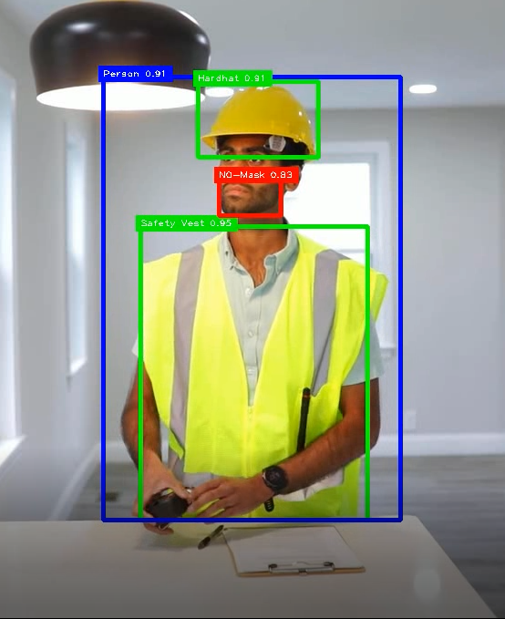

# 🦺 Workplace Safety PPE Detection System

This project is an **AI-powered Workplace Safety Monitoring System** built using **YOLOv8**, **OpenCV**, and **cvzone**.
It automatically detects whether workers are wearing **Personal Protective Equipment (PPE)** such as **Hardhats, Masks, and Safety Vests** in real time through webcam or video footage.

---

## 🎯 Project Objective

To enhance workplace safety by leveraging **computer vision** to:

* Identify if workers are following **safety compliance** rules.
* Detect missing PPE such as helmets, vests, and masks.
* Provide a real-time visual alert for non-compliance.

---

## 🧠 Model and Dataset

This system uses a **YOLOv8 model** trained on a **PPE detection dataset** containing classes such as:

* `Hardhat`
* `Mask`
* `NO-Hardhat`
* `NO-Mask`
* `NO-Safety Vest`
* `Safety Vest`
* `Person`
* `Safety Cone`
* `Machinery`
* `Vehicle`

📦 **Model Used:** `ppe.pt`
🧩 **Framework:** [Ultralytics YOLOv8](https://github.com/ultralytics/ultralytics)

---

## ⚙️ Technologies Used

| Tool                     | Purpose                                             |
| ------------------------ | --------------------------------------------------- |
| **Python**               | Programming language                                |
| **YOLOv8 (Ultralytics)** | Object detection backbone                           |
| **OpenCV**               | Real-time image and video processing                |
| **cvzone**               | Visual enhancements (bounding boxes, text overlays) |
| **Math**                 | Confidence calculations and precision               |

---

## 🧩 System Workflow

1. **Video Input:**
   The model can use either a **webcam feed** or **video file**.

2. **YOLO Inference:**
   Each frame is passed through the YOLOv8 model to detect objects.

3. **Class Identification:**
   The model identifies PPE items and classifies them into:

   * ✅ Safe (Green) — `Hardhat`, `Mask`, `Safety Vest`
   * ❌ Unsafe (Red) — `NO-Hardhat`, `NO-Mask`, `NO-Safety Vest`
   * ⚙️ Neutral (Blue) — `Person`, `Machinery`, etc.

4. **Visual Overlay:**
   Bounding boxes and labels are drawn using **cvzone** with corresponding color codes.

5. **Alert Mechanism:**
   Objects detected without PPE are highlighted clearly in red for quick awareness.

---

## 🖥️ How to Run the Project

```bash
# Clone this repository
git clone https://github.com/UsamaMunawarr/PPE-Detection-YOLOv8.git
cd PPE-Detection-YOLOv8

# Install dependencies
pip install ultralytics opencv-python cvzone

# Run the app
python ppe_detection.py
```

---

## 🎥 Demo

Here’s a quick look at the system in action 👇


---

## 📸 Sample Detection

Below is detections from the model:

 

---

## 🧱 Project Structure

```
📁 PPE-Detection-YOLOv8
│
├── ppe_detection.py        # Main detection script
├── ppe.pt                  # YOLOv8 trained weights
├── assets/                 # Screenshots and GIFs
│   ├── test.gif
│   ├── test.PNG
└── README.md               # Project documentation
```

---

## 👨‍💻 About the Developer

**Usama Munawar** – Data Scientist | MPhil Scholar | Machine Learning Enthusiast  
Passionate about transforming raw data into meaningful insights and intelligent systems.  

🌍 Connect with me:

[](https://github.com/UsamaMunawarr)[](https://www.linkedin.com/in/abu--usama)[](https://www.youtube.com/@CodeBaseStats)[](https://twitter.com/Usama__Munawar?t=Wk-zJ88ybkEhYJpWMbMheg&s=09)[](https://www.facebook.com/profile.php?id=100005320726463&mibextid=9R9pXO)
---

## 📜 License

This project is licensed under the **MIT License**.
You may use, modify, and distribute it with proper credit.


